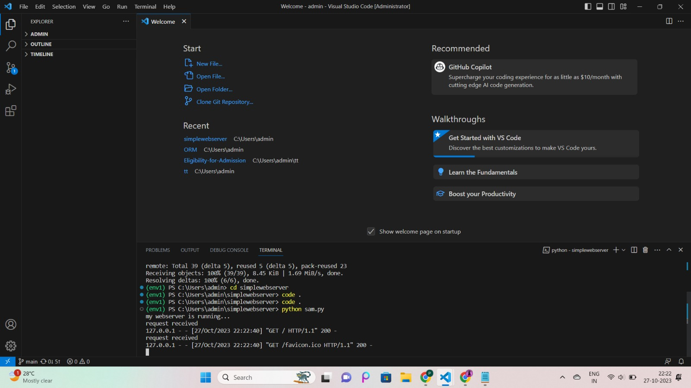
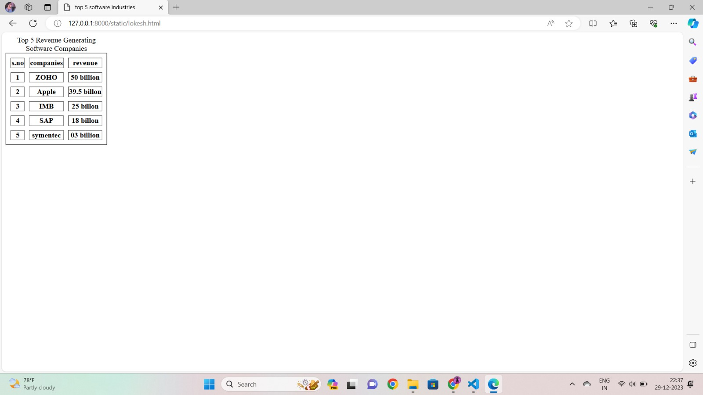

# EX01 Developing a Simple Webserver
## Date:

## AIM:
To develop a simple webserver to serve html pages.

## DESIGN STEPS:
### Step 1: 
HTML content creation.

### Step 2:
Design of webserver workflow.

### Step 3:
Implementation using Python code.

### Step 4:
Serving the HTML pages.

### Step 5:
Testing the webserver.

## PROGRAM:

```
from http.server import HTTPServer, BaseHTTPRequestHandler
content = """
<html>
      <title>top 5 software industries</title>
      <body>
             <table border="2" cellspacing="10" cellpaddding="6">
                     <caption> Top 5 Revenue Generating Software Companies </caption>
                     <tr>
<th>s.no</th>
<th>companies</th>
<th>revenue</th> 
</tr>  
<tr> 
<th>1</th>
<th>Microsoft</th>
<th>65 billion</th>
</tr>
<tr>
<th>2</th>
<th>oracle</th>
<th>29.5 billon</th>
</tr>
<tr>
<th>3</th>
<th>IBM </th>
<th>29.1 billon</th>
</tr>
<tr>
<th>4</th>
<th>SAP</th>
<th>6.4 billon</yh>
```

## OUTPUT:


## RESULT:
The program for implementing simple webserver is executed successfully.
